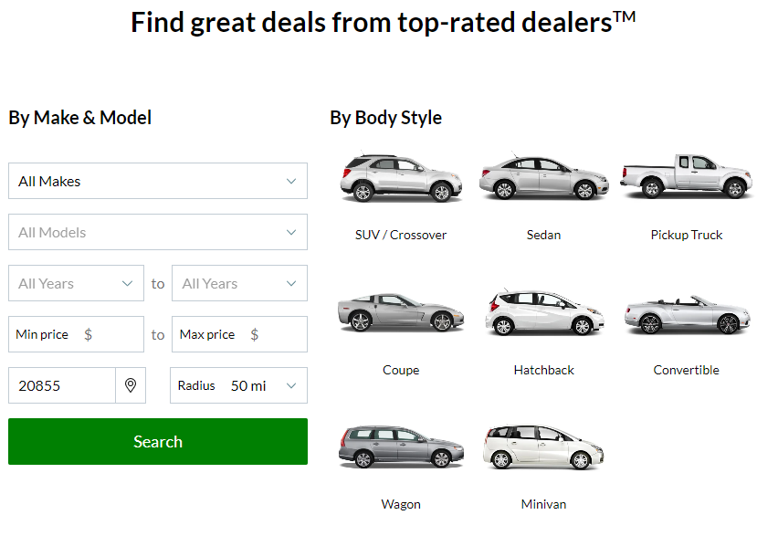
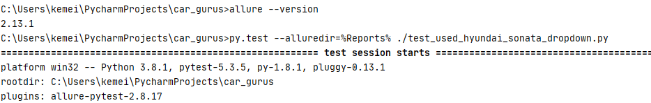
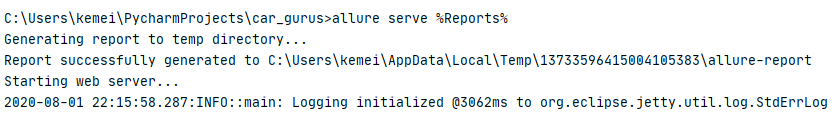
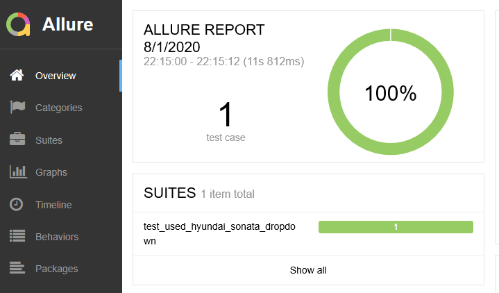
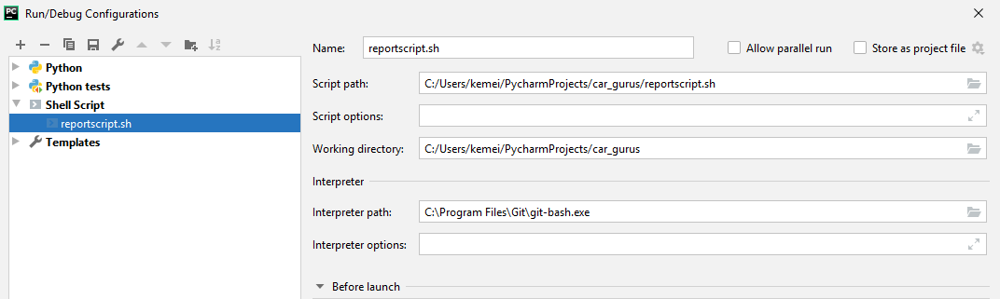
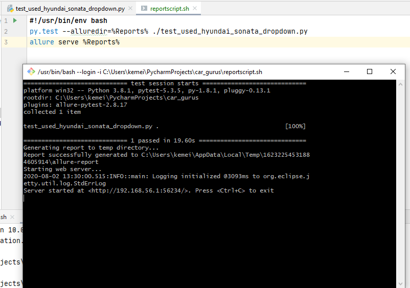

This is a simple example of a test script written using **Python**, **Selenium WebDriver** and **PyTest**. 

Here is a [link](https://github.com/kipkitur/car_gurus/blob/main/test_used_hyundai_sonata_dropdown.py) to the test script.

**Important:**

Please note that this is a small script hence script maintenance looks easy. But with time test suite will grow. As you add more and more lines to your code, things become tough. The main problem with script maintenance is that if 10 different scripts are using the same page element, with any change in that element, you need to change all 10 scripts. This is time consuming, error prone, expensive to maintain and is not the right approach for test automation.

A better approach to script maintenance is to create a separate class file which would find web elements, fill them or verify them. This class can be reused in all the scripts using that element. In future, if there is a change in the web element, we need to make the change in just 1 class file and not 10 different scripts.

You can accomplish this using Page Object Model(POM). It helps make the code more readable, maintainable, and reusable.

**Test case description:**
Verify that the user is able to search for a vehicle by make, model, year(min/max), price(min/max), zip code and radius.
Use the test data in the table below;

| Name/ID | Value |
| ----------- | ----------- |
| selectedMakeId | Hyundai |
| selectedModelId | Sonata |
| selectedStartYear  | 2015 |
| selectedEndYear  | 2017 |
| minPrice | 12000 |
| maxPrice | 16000 |
| postal-code-input | 22041 |
| radius | 25 miles |

Expected Result;

Used Hyundai Sonata will be displayed. 

Actual result;

As expected

Used Hyundai Sonata results page

For this example, **ChromeDriver** version is 83 and should be located inside your downloads folder ("\\Users\\user_name\\Downloads\\chromedriver_win32\\chromedriver.exe"). Make sure to replace "user_name" with a suitable name from your file path.
Please update it according to your version of Google Chrome installed on your machine when running locally.

**Pre-requisites:**

I am using the [cargurus](https://www.cargurus.com/Cars/forsale) used car search page. 

**Environment setup:**

Please make sure you have **Python** installed [link](https://www.python.org/downloads/)

Please make sure you have **PyCharm** installed [link](https://www.jetbrains.com/pycharm/download/)

To install the necessary packages using **PyCharm** (on **Windows 10**):

1. Open your project in **PyCharm**.
2. Click on **File -> Settings**.
3. In the search field type in **Interpreter**.
4. In the new window, click on **+** sign to add new packages.
5. Type in **selenium** and click on **Install Package**.
6. Type in **pytest** and click on **Install Package**.
7. Close Packages and Settings windows.

Make sure you have the packages installed otherwise you won't be able to import the modules and run your tests.

You can run your test via terminal. Type **pytest -v filename** or **pytest -v** to run all other tests you have in the folder.

**Reports**
To generate test automation report you only need to install allure-pytest package.

Navigate to File(top right corner of Pycharm) and click on Settings. Click on Project Interpreter. Click on the **+** symbol and type in allure in the search box. Select allure-pytest and click on **install package**.

Verify whether you have correctly installed allure by checking the version installed from the terminal.

It is time to run the test, gather results and generate a test report. 

To enable Allure listener to collect results during the test execution simply add
--alluredir option and provide a path to the folder where results should be stored. The test results as “.XML” files. In our example, I created a folder named "Reports" and added the path to my test scrupt. This is what my command looks like:

**py.test --alluredir=%Reports% ./test_used_hyundai_sonata_dropdown.py**

To see the actual report after your tests have finished, you need to use allure command-line utility to generate a report from the results.

This command will show you generated a report in your default browser. 

**$ allure serve %Reports%**

Here is a screenshot.

Alternatively, you can **automate** the test by running a shell script.

Prerequisites:
Make sure you have [git bash](https://gitforwindows.org/) installed if you are on Windows.

Create a bash script in the project directory. Here is [link](https://github.com/kipkitur/car_gurus/blob/main/reportscript.sh) to the script I created.

Navigate to file settings and add bash package in your project interpreter.

Navigate to run/debug configurations and edit the interpreter path to point to where git-bash is installed on your machine.

Now run the test. 

Git bash will start a new session and execute your test as shown below.

