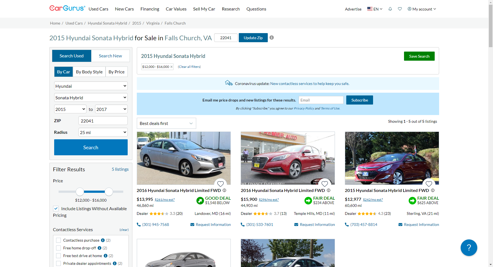

This is a simple example of a test script written using **Python**, **Selenium WebDriver** and **PyTest**. 

**Test case description:**
Verify that the user is able to search for a vehicle.
Use the test data in the table below;

| Name/ID | Value |
| ----------- | ----------- |
| selectedMakeId | Hyundai |
| selectedModelId | Sonata |
| selectedStartYear  | 2015 |
| selectedEndYear  | 2017 |
| minPrice | 12000 |
| maxPrice | 16000 |
| postal-code-input | 22041 |
| radius | 25 miles |

Expected Result;

Car gurus used car filter page will open. User will fill the test data in the search field on the left corner of the web page and click on the search button. Used hyundai sonata will be displayed. 

Actual result;

For this example, **ChromeDriver** version is 83 and should be located inside your downloads folder ("\\Users\\user_name\\Downloads\\chromedriver_win32\\chromedriver.exe"). Make sure to replace "user_name" with a suitable name from your file path.
Please update it according to your version of Google Chrome installed on your machine when running locally.

**Pre-requisites:**

I am using the [car gurus](https://www.cargurus.com/Cars/forsale) used car search page. 

**Environment setup:**

Please make sure you have **Python** installed [link](https://www.python.org/downloads/)

Please make sure you have **PyCharm** installed [link](https://www.jetbrains.com/pycharm/download/)

To install the necessary packages using **PyCharm** (on **Windows 10**):

1. Open your project in **PyCharm**.
2. Click on **File -> Settings**.
3. In the search field type in **Interpreter**.
4. In the new window, click on **+** sign to add new packages.
5. Type in **selenium** and click on **Install Package**.
6. Type in **pytest** and click on **Install Package**.
7. Close Packages and Settings windows.

Make sure you have the packages installed otherwise you won't be able to import the modules and run your tests.

You can run your test via terminal. Type **pytest -v filename** or **pytest -v** to run all other tests you have in the folder.
